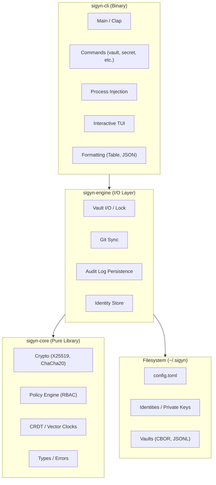
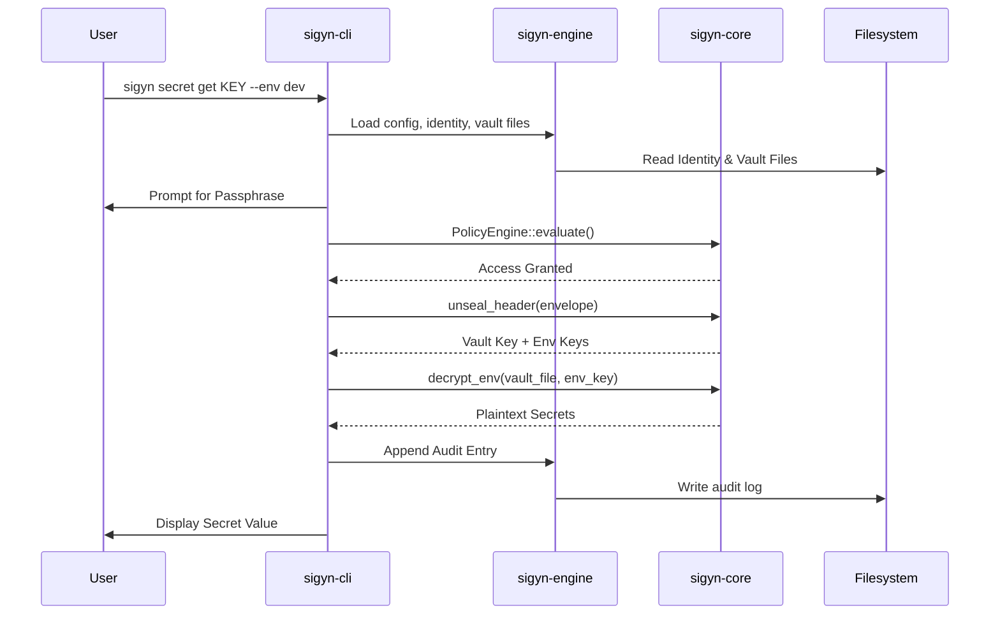

# Sigyn Architecture

This document describes the high-level architecture of Sigyn, a serverless encrypted
peer-to-peer secret manager implemented in Rust.

## High-Level Architecture



## Data Flow

A typical secret read follows this path:



## Cargo Workspace

Sigyn is organized as a Cargo workspace with four crates and an integration test suite:

```
sigyn/
  Cargo.toml              # Workspace root (resolver = "2")
  crates/
    sigyn-core/           # Pure library (publishable, zero I/O)
    sigyn-engine/         # I/O layer (filesystem, git, persistence)
    sigyn-cli/            # CLI binary (clap-based)
    sigyn-recovery/       # Standalone recovery binary
  tests/
    integration/          # Integration test crate
```

| Crate | Role | Key Trait |
|---|---|---|
| **sigyn-core** | Pure business logic: cryptography, policy evaluation, CRDT merge, types, and errors. Has zero I/O side effects -- no `git2`, `tempfile`, `fd-lock`, or `directories` dependencies. Publishable to crates.io. | `thiserror` for typed errors |
| **sigyn-engine** | I/O layer: filesystem operations, git sync, audit log persistence, identity storage, vault locking. Depends on and re-exports `sigyn-core`. | `thiserror` for typed errors |
| **sigyn-cli** | The `sigyn` binary. Parses arguments (clap 4), performs network I/O, renders output (tables, JSON, TUI). | `anyhow` for ergonomic CLI errors |
| **sigyn-recovery** | A standalone binary for disaster recovery using Shamir secret sharing. Intentionally minimal so it can be distributed independently of the main CLI. | `thiserror` in shared code |

### Dependency Boundary

```
sigyn-core  (pure, publishable)
     ↑
sigyn-engine  (I/O layer, re-exports sigyn-core)
     ↑
sigyn-cli / sigyn-recovery
```

`sigyn-core` has no I/O dependencies and can be tested in complete isolation.
`sigyn-engine` re-exports everything from `sigyn-core`, so downstream crates only need
to depend on `sigyn-engine` to access both pure logic and I/O operations.

## On-Disk Layout

All Sigyn data lives under `~/.sigyn/` by default (determined via the `directories` crate):

```
~/.sigyn/
  config.toml                   # Global configuration (TOML)
  identities/
    <name>/
      identity.toml             # Identity metadata (name, fingerprint)
      secret_key.enc            # Argon2id-wrapped Ed25519 + X25519 keypair
  vaults/
    <name>/
      vault.toml                # Vault metadata (UUID, name, created_at)
      members.cbor              # Envelope header: vault key slots + per-env key slots
      policy.cbor               # RBAC policy, member list, constraints
      envs/
        dev.vault               # Encrypted environment file (CBOR, per-env key)
        staging.vault
        prod.vault
      audit.log.json            # Hash-chained audit trail (JSON Lines)
      forks.cbor                # Fork metadata and state
```

### Data Formats

| Format | Used For | Rationale |
|---|---|---|
| **CBOR** (via `ciborium`) | Encrypted blobs (`members.cbor`, `policy.cbor`, `*.vault`, `forks.cbor`) | Compact binary format, schema-flexible, well-suited for encrypted payloads |
| **TOML** (via `toml`) | Human-readable configuration (`config.toml`, `vault.toml`, `identity.toml`) | Easy to read and edit by hand, standard in Rust ecosystem |
| **JSON Lines** (via `serde_json`) | Audit log (`audit.log.json`) | Append-only, one entry per line, streamable, easy to pipe through `jq` |

## Key Design Decisions

### Error Handling: thiserror in Core, anyhow in CLI

`sigyn-core` uses `thiserror` to define a comprehensive `SigynError` enum. This gives
callers precise, matchable error variants (e.g., `SigynError::NoMatchingSlot`,
`SigynError::AuditChainBroken(u64)`). The CLI layer uses `anyhow` to ergonomically
wrap these errors with context for display to the user.

### Sync Core, Async Only in CLI

`sigyn-core` is fully synchronous. It contains no `async` code, no Tokio dependency,
and no network I/O. The `sigyn-cli` crate is the only place where `tokio` and `reqwest`
appear. This keeps the core library testable with standard `#[test]` functions and
avoids async coloring the entire codebase.

### Sensitive Memory: secrecy::Secret + zeroize

All sensitive key material is wrapped in `secrecy::Secret<T>` and derives `Zeroize`.
When a `Secret` is dropped, its memory is securely zeroed. This applies to:

- Master keys
- Private keys (X25519, Ed25519)
- Passphrase-derived keys
- Decrypted secret values in transit

### Atomic File Writes via tempfile::persist()

All file writes in `sigyn-engine` go through a write-to-temp-then-persist pattern using
`tempfile::NamedTempFile` and its `persist()` method. This prevents partial writes
from corrupting vault data if the process is interrupted. The `fd-lock` crate provides
advisory file locking for concurrent access safety.

### Minimum Rust Version

The workspace requires Rust 1.75+ (`rust-version = "1.75"` in `Cargo.toml`).

### Release Profile

Release builds use LTO, strip symbols, and single codegen unit for minimal binary size:

```toml
[profile.release]
lto = true
strip = true
codegen-units = 1
```

## Module Overview

Sigyn is organized into logical modules split across the core library, engine, and CLI:

### sigyn-core Modules (Pure, No I/O)

| Module | Responsibility |
|---|---|
| **crypto** | Key generation, X25519 Diffie-Hellman, envelope encryption/decryption (vault key + per-env key slots), ChaCha20-Poly1305 AEAD, Argon2id KDF, HKDF key derivation, nonce management |
| **vault** | Vault manifest types, env file encryption/decryption (pure computation) |
| **secrets** | Secret value types, validation rules, cross-references, random secret generation, per-key ACLs |
| **identity** | Identity/LoadedIdentity types, passphrase wrapping, Shamir secret sharing, MFA types and sessions |
| **environment** | Environment management, per-env policy, diffing, secret promotion |
| **policy** | 7-level RBAC, member policy, secret ACLs, `PolicyEngine::evaluate()`, constraint checking, policy serialization |
| **delegation** | Delegation tree structure, Ed25519-signed invitations, cascade revocation |
| **forks** | Fork types, approval workflows, fork expiry |
| **audit** | Audit entry and witness types |
| **sync** | Vector clocks, LWW-Map CRDT, conflict detection and resolution |
| **rotation** | Key rotation, cron-based scheduling, rotation history, hooks, breach mode, dead-check |
| **hierarchy** | Hierarchical policy engine, node manifests, OrgPath type |

### sigyn-engine Modules (I/O Layer)

| Module | Responsibility |
|---|---|
| **vault** | Env file read/write, vault locking (fd-lock), vault path resolution and directory scanning |
| **identity** | Identity store (filesystem), MFA store, MFA session store |
| **audit** | Hash-chained audit log (file-based), git anchoring, witness log persistence |
| **sync** | Git-based sync engine (git2) |
| **hierarchy** | Hierarchy paths (filesystem), slot management (CBOR read/write), git remote resolution |
| **forks** | Fork creation with filesystem operations (leashed/unleashed) |
| **policy** | `VaultPolicyExt` trait for filesystem-based policy save/load |

### sigyn-cli Modules

| Module | Files | Responsibility |
|---|---|---|
| **commands** | `identity.rs`, `vault.rs`, `secret.rs`, `env.rs`, `policy.rs`, `sync.rs`, `audit.rs`, `fork.rs`, `run.rs`, `rotate.rs`, `delegation.rs`, `import.rs`, `status.rs` | One file per CLI subcommand group |
| **inject** | `mod.rs`, `dotenv.rs`, `export.rs`, `process.rs`, `socket.rs` | Secret injection into child processes, dotenv export, Unix socket serving |
| **importexport** | `mod.rs`, `cloud.rs` | Import from dotenv/JSON/cloud providers (Doppler, AWS, GCP, 1Password) |
| **tui** | `mod.rs` | Interactive TUI dashboard (ratatui + crossterm) |
| **notifications** | `mod.rs` | Expiry warnings, rotation reminders |
| **output** | `mod.rs` | Formatting helpers (tables via `tabled`, JSON output, success/error messages) |

## Data Flow

A typical secret read follows this path:

```
User runs: sigyn secret get DATABASE_URL --env dev

  sigyn-cli
    1. Parse CLI args (clap)

  sigyn-engine (I/O)
    2. Load config.toml, resolve vault + identity
    3. Read identity secret key, read vault files (members.cbor, policy.cbor, envs/dev.vault)

  sigyn-cli
    4. Prompt for passphrase, unwrap via Argon2id

  sigyn-core (pure)
    5. PolicyEngine::evaluate() -- check RBAC, constraints, ACLs
    6. unseal_header() -- X25519 DH to recover vault key + per-env keys from envelope
    7. VaultCipher::decrypt() -- ChaCha20-Poly1305 decrypt the env file with that env's key
    8. Extract the requested key from the decrypted map

  sigyn-engine (I/O)
    9. Append audit entry (hash-chained, Ed25519 signed)

  sigyn-cli
   10. Output the secret value (plaintext to stdout, or JSON if --json)
```

Every write operation follows the same policy evaluation path. There is no bypass.
See [Security Model](security.md) for details on the cryptographic primitives and
policy engine.

## Related Documentation

- [Security Model](security.md) -- cryptographic primitives, threat model, policy engine
- [CLI Reference](cli-reference.md) -- complete command reference
- [Getting Started](getting-started.md) -- step-by-step tutorial
- [Delegation](delegation.md) -- invitation and revocation system
- [Sync](sync.md) -- git-based synchronization and conflict resolution
