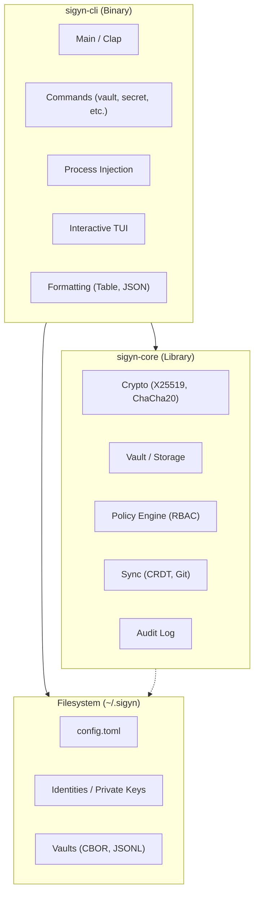
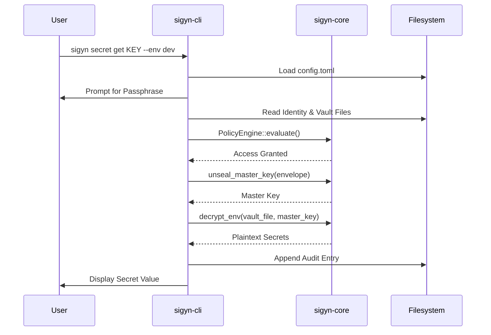

# Sigyn Architecture

This document describes the high-level architecture of Sigyn, a serverless encrypted
peer-to-peer secret manager implemented in Rust.

## High-Level Architecture



## Data Flow

A typical secret read follows this path:



## Cargo Workspace

Sigyn is organized as a Cargo workspace with three crates and an integration test suite:

```
sigyn/
  Cargo.toml              # Workspace root (resolver = "2")
  crates/
    sigyn-core/           # Business logic library (no I/O side effects)
    sigyn-cli/            # CLI binary (clap-based)
    sigyn-recovery/       # Standalone recovery binary
  tests/
    integration/          # Integration test crate
```

| Crate | Role | Key Trait |
|---|---|---|
| **sigyn-core** | Pure business logic: cryptography, policy evaluation, CRDT merge, audit chain verification. Has zero I/O side effects -- no network calls, no filesystem writes. All I/O is driven by the caller. | `thiserror` for typed errors |
| **sigyn-cli** | The `sigyn` binary. Parses arguments (clap 4), performs filesystem and network I/O, renders output (tables, JSON, TUI). | `anyhow` for ergonomic CLI errors |
| **sigyn-recovery** | A standalone binary for disaster recovery using Shamir secret sharing. Intentionally minimal so it can be distributed independently of the main CLI. | `thiserror` in shared code |

### Dependency Boundary

```
sigyn-cli ──depends-on──> sigyn-core
sigyn-recovery ──depends-on──> sigyn-core
```

`sigyn-core` never depends on `sigyn-cli` or `sigyn-recovery`. This ensures the core
logic can be tested in isolation without any I/O mocking.

## On-Disk Layout

All Sigyn data lives under `~/.sigyn/` by default (determined via the `directories` crate):

```
~/.sigyn/
  config.toml                   # Global configuration (TOML)
  identities/
    <name>/
      identity.toml             # Identity metadata (name, fingerprint)
      secret_key.enc            # Argon2id-wrapped Ed25519 + X25519 keypair
  vaults/
    <name>/
      vault.toml                # Vault metadata (UUID, name, created_at)
      members.cbor              # Envelope header: encrypted master key slots
      policy.cbor               # RBAC policy, member list, constraints
      envs/
        dev.vault               # Encrypted environment file (CBOR)
        staging.vault
        prod.vault
      audit.log.json            # Hash-chained audit trail (JSON Lines)
      forks.cbor                # Fork metadata and state
```

### Data Formats

| Format | Used For | Rationale |
|---|---|---|
| **CBOR** (via `ciborium`) | Encrypted blobs (`members.cbor`, `policy.cbor`, `*.vault`, `forks.cbor`) | Compact binary format, schema-flexible, well-suited for encrypted payloads |
| **TOML** (via `toml`) | Human-readable configuration (`config.toml`, `vault.toml`, `identity.toml`) | Easy to read and edit by hand, standard in Rust ecosystem |
| **JSON Lines** (via `serde_json`) | Audit log (`audit.log.json`) | Append-only, one entry per line, streamable, easy to pipe through `jq` |

## Key Design Decisions

### Error Handling: thiserror in Core, anyhow in CLI

`sigyn-core` uses `thiserror` to define a comprehensive `SigynError` enum. This gives
callers precise, matchable error variants (e.g., `SigynError::NoMatchingSlot`,
`SigynError::AuditChainBroken(u64)`). The CLI layer uses `anyhow` to ergonomically
wrap these errors with context for display to the user.

### Sync Core, Async Only in CLI

`sigyn-core` is fully synchronous. It contains no `async` code, no Tokio dependency,
and no network I/O. The `sigyn-cli` crate is the only place where `tokio` and `reqwest`
appear. This keeps the core library testable with standard `#[test]` functions and
avoids async coloring the entire codebase.

### Sensitive Memory: secrecy::Secret + zeroize

All sensitive key material is wrapped in `secrecy::Secret<T>` and derives `Zeroize`.
When a `Secret` is dropped, its memory is securely zeroed. This applies to:

- Master keys
- Private keys (X25519, Ed25519)
- Passphrase-derived keys
- Decrypted secret values in transit

### Atomic File Writes via tempfile::persist()

All file writes in the CLI go through a write-to-temp-then-persist pattern using
`tempfile::NamedTempFile` and its `persist()` method. This prevents partial writes
from corrupting vault data if the process is interrupted. The `fd-lock` crate provides
advisory file locking for concurrent access safety.

### Minimum Rust Version

The workspace requires Rust 1.75+ (`rust-version = "1.75"` in `Cargo.toml`).

### Release Profile

Release builds use LTO, strip symbols, and single codegen unit for minimal binary size:

```toml
[profile.release]
lto = true
strip = true
codegen-units = 1
```

## Module Overview

Sigyn is organized into 16 logical modules spanning the core library and CLI:

### sigyn-core Modules

| Module | Files | Responsibility |
|---|---|---|
| **crypto** | `keys.rs`, `envelope.rs`, `vault_cipher.rs`, `kdf.rs`, `nonce.rs` | Key generation, X25519 Diffie-Hellman, envelope encryption/decryption, ChaCha20-Poly1305 AEAD, Argon2id KDF, HKDF key derivation, nonce management |
| **vault** | `mod.rs`, `manifest.rs`, `env_file.rs`, `lock.rs`, `path.rs` | Vault creation, opening, locking, path resolution, manifest serialization |
| **secrets** | `mod.rs`, `types.rs`, `validation.rs`, `reference.rs`, `generation.rs`, `acl.rs` | Secret value types, validation rules, cross-references between secrets, random secret generation, per-key ACLs |
| **identity** | `mod.rs`, `profile.rs`, `wrapping.rs`, `keygen.rs`, `shamir.rs`, `mfa.rs`, `session.rs` | Identity creation, passphrase wrapping/unwrapping, keypair generation, Shamir secret sharing for recovery, TOTP-based MFA state and sessions |
| **environment** | `mod.rs`, `policy.rs`, `diff.rs`, `promotion.rs` | Environment management, per-env policy, diffing between environments, secret promotion across envs |
| **policy** | `mod.rs`, `roles.rs`, `member.rs`, `acl.rs`, `engine.rs`, `storage.rs`, `constraints.rs` | 7-level RBAC, member policy, secret ACLs, `PolicyEngine::evaluate()`, constraint checking (time windows, expiry, MFA) |
| **delegation** | `mod.rs`, `tree.rs`, `invite.rs`, `revoke.rs` | Delegation tree structure, Ed25519-signed invitation files, cascade revocation with master key rotation |
| **forks** | `mod.rs`, `types.rs`, `approval.rs`, `leash.rs`, `expiry.rs` | Fork creation (leashed/unleashed), approval workflows, leash management, fork expiry |
| **audit** | `mod.rs`, `entry.rs`, `chain.rs`, `anchor.rs`, `witness.rs` | Hash-chained audit entries, Ed25519 signed entries, chain verification, external anchoring, witness countersigning |
| **sync** | `mod.rs`, `vector_clock.rs`, `crdt.rs`, `conflict.rs`, `state.rs`, `git.rs`, `mdns.rs` | Vector clocks, LWW-Map CRDT, conflict detection and resolution, git-based sync, LAN peer discovery |
| **rotation** | `mod.rs`, `schedule.rs`, `history.rs`, `hooks.rs`, `breach.rs`, `dead.rs` | Key rotation, cron-based scheduling, rotation history, pre/post-rotation hooks, breach mode, dead-check detection |

### sigyn-cli Modules

| Module | Files | Responsibility |
|---|---|---|
| **commands** | `identity.rs`, `vault.rs`, `secret.rs`, `env.rs`, `policy.rs`, `sync.rs`, `audit.rs`, `fork.rs`, `run.rs`, `rotate.rs`, `delegation.rs`, `import.rs`, `status.rs` | One file per CLI subcommand group |
| **inject** | `mod.rs`, `dotenv.rs`, `export.rs`, `process.rs`, `socket.rs` | Secret injection into child processes, dotenv export, Unix socket serving |
| **importexport** | `mod.rs`, `cloud.rs` | Import from dotenv/JSON/cloud providers (Doppler, AWS, GCP, 1Password) |
| **tui** | `mod.rs` | Interactive TUI dashboard (ratatui + crossterm) |
| **notifications** | `mod.rs` | Expiry warnings, rotation reminders |
| **output** | `mod.rs` | Formatting helpers (tables via `tabled`, JSON output, success/error messages) |

## Data Flow

A typical secret read follows this path:

```
User runs: sigyn secret get DATABASE_URL --env dev

  sigyn-cli
    1. Parse CLI args (clap)
    2. Load config.toml, resolve vault + identity
    3. Read identity secret key, prompt for passphrase, unwrap via Argon2id
    4. Read vault files: members.cbor, policy.cbor, envs/dev.vault

  sigyn-core
    5. PolicyEngine::evaluate() -- check RBAC, constraints, ACLs
    6. unseal_master_key() -- X25519 DH to recover master key from envelope
    7. VaultCipher::decrypt() -- ChaCha20-Poly1305 decrypt the env file
    8. Extract the requested key from the decrypted map

  sigyn-cli
    9. Append audit entry (hash-chained, Ed25519 signed)
   10. Output the secret value (plaintext to stdout, or JSON if --json)
```

Every write operation follows the same policy evaluation path. There is no bypass.
See [Security Model](security.md) for details on the cryptographic primitives and
policy engine.

## Related Documentation

- [Security Model](security.md) -- cryptographic primitives, threat model, policy engine
- [CLI Reference](cli-reference.md) -- complete command reference
- [Getting Started](getting-started.md) -- step-by-step tutorial
- [Delegation](delegation.md) -- invitation and revocation system
- [Sync](sync.md) -- git-based synchronization and conflict resolution
